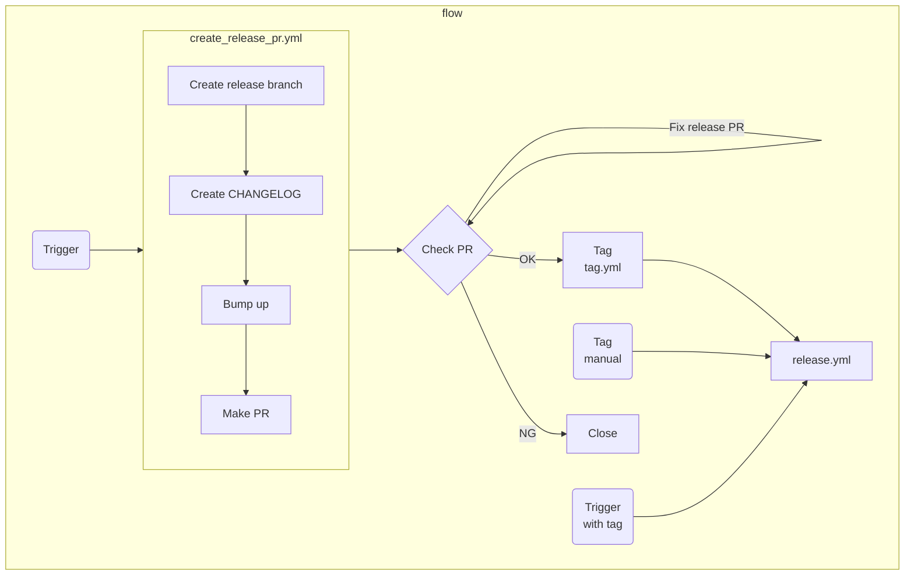

# CI/CD Workflows

## Purpose

Automate releasing:

- Releasing NPM/VSCode extension package
- Releasing to Github release page
- Tagging
- Making release node

Automate testing:

- Building
- Testing
- Packaging
- Linting

## Typical Workflows

The process is based on [Github flow](https://docs.github.com/en/get-started/quickstart/github-flow). The main branch is just `main`, and all of other branches are branched from `main` branch including feature, fix, chore and so on. Of course developer can make branch from your feature branch, but it should be hidden in the developer's own development process. All contributing to the project should be form of PR to `main` branch. It's includes `release` too.

### Feature Development

Creating a feature branch from `main` branch and make a PR to `main` as you know. But need to take care about commit history.

- Make [conventional commits](https://www.conventionalcommits.org/)
- Commit history should be **clean**

Since the project employs [semantic versioning](https://semver.org/) and automating [bumping up and CHANGELOG](https://github.com/conventional-changelog/conventional-changelog), the contents of commit history are so important.

- If the commits from the latest tag includes `BREAKING CHANGE`, major version will be bumped.
- Else if it includes `feat:`, minor version will be bumped.
- Else if it includes `fix:`, patch version will be bumped.
- Otherwise, nothing should be released (e.g. just improving test, ci, refactoring and so on)

### Releasing

The release procedure is automated as the follows. Ths things user need to do is **bold** process.

1. **Trigger release in Github workflow page**
2. Make CHANGELOG according to the commit history
3. Bump up version according to the commit history
4. Make release branch and PR
5. **Check release PR and merge it**
	- If there is something to be fixed, just add commits to the PR
6. Tag with new version
7. Release

## Specifications

- Release version : `vX.X.X`
- Release tag : `vX.X.X`
- Release commit : `chore: bump vX.X.X`
- Release branch : `release/vX.X.X`
- Release PR
	- Title : `Release vX.X.X`
	- labels : [`release`]
